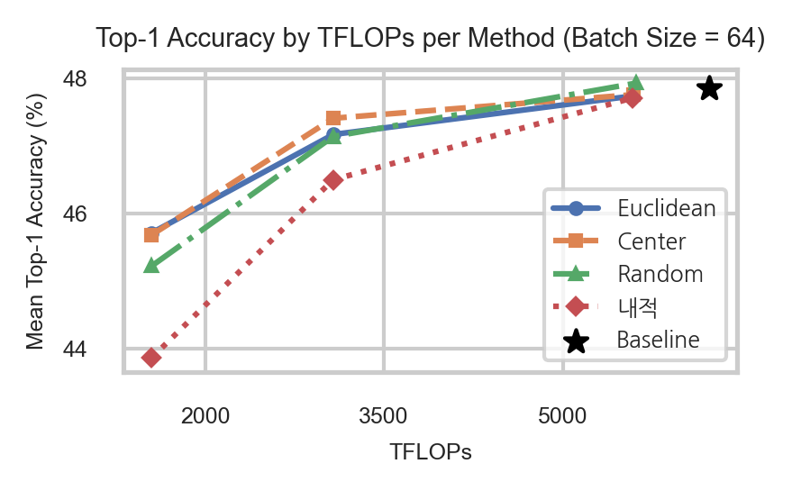

# A Coreset-Based Algorithm for Improving the Efficiency of Test-Time Adaptation under Domain Shift and Corruption

본 프로젝트는 EATA(Efficient Test-Time Adaptation) 알고리즘에 기반하여,
다양한 coreset selection 전략을 적용한 경량화 TTA 프레임워크입니다.

---
## 🔍 소개 (Overview)

- **원본 기반**: [EATA (ICML 2022)](https://github.com/mr-eggplant/EATA.git)
- **개선 내용**: 본 프로젝트에서는 test-time의 연산량(FLOPs)을 줄이기 위해,
  representative sample만을 선택하는 coreset 기반 적응 방식을 도입했습니다.
  
- **적용 기법**:
  - Euclidean 기반 거리 선택
  - Center-based 거리
  - Dot product 기반 herding
  - Random sampling (baseline)
  
---

## Usage(Coreset selection):
python3 main_coreset.py --data /path/to/imagenet --data_corruption /path/to/imagenet-c --exp_type 'each_shift_reset' --algorithm 'eata_coreset_center_based_distance' or 'eata_coreset_euclidean' or 'eata_coreset_dot_product' --batch_size 64 --coreset_size 32 --output /output/dir

--algorithm:
eata_coreset_center_based_distance
eata_coreset_euclidean
eata_coreset_dot_product
--batch_size: 64, 128, 256
--coreset_size: 64, 32, 16, 8 (must < batch size)

## Usage(random sampling):
python3 main_coreset.py --data /path/to/imagenet --data_corruption /path/to/imagenet-c --exp_type 'each_shift_reset' --algorithm 'eata_random_sampling' --batch_size 64 --filtering_size 32 --seed 1013 --output /output/dir

--batch_size: 64, 128, 256
--coreset_size: 64, 32, 16, 8 (must < batch size)
--seed: 1013, 2029, 3617

## Results:
We report the results on ImageNet-C, severity level = 5, with ResNet-50.

**[표 1] FLOPs 및 샘플 수 대비 정확도 비교 (Center Herding 기준)**
| Batch Size | Coreset Size | Filtered Samples | Estimated adaptation(backward) FLOPs (TFLOPs) | Mean Accuracy (%) |
| ---------- | ------------ | ---------------- | ------------------------ | ----------------- |
| 64         | -            | 377,083          | 6,229                    | 47.85             |
| 64         | 32           | 338,720          | 5,596                    | 47.76             |
| 64         | 16           | 186,076          | 3,074                    | 47.41             |
| 64         | 8            | 93,661           | 1,547                    | 45.68             |
| 128        | -            | 355,023          | 5,865                    | 47.59             |
| 128        | 64           | 324,644          | 5,363                    | 47.62             |
| 128        | 32           | 184,878          | 3,054                    | 47.59             |
| 128        | 16           | 93,575           | 1,546                    | 46.81             |
| 128        | 8            | 46,907           | 775                      | 44.84             |
| 256        | -            | 322,430          | 5,327                    | 46.86             |
| 256        | 64           | 181,695          | 3,002                    | 46.16             |
| 256        | 32           | 93,521           | 1,545                    | 45.97             |
| 256        | 16           | 47,034           | 777                      | 45.17             |
| 256        | 8            | 23,520           | 389                      | 43.67             |

**[표 2] 다양한 coreset 방식별 평균 정확도 비교**
| Batch Size | Coreset Size | Center Herding (%) | Dot Product Herding (%) | Euclidean Herding (%) | Random Sampling (%) |
| ---------- | ------------ | ------------------ | ----------------------- | --------------------- | ------------------- |
| 64         | 32           | 47.76              | 47.71                   | 47.74                 | 47.93               |
| 64         | 16           | 47.41              | 46.50                   | 47.17                 | 47.14               |
| 64         | 8            | 45.68              | 43.86                   | 45.71                 | 45.22               |
| 128        | 64           | 47.62              | 47.54                   | 47.59                 | 47.65               |
| 128        | 32           | 47.59              | 46.85                   | 47.34                 | 47.25               |
| 128        | 16           | 46.81              | 45.64                   | 46.50                 | 46.17               |
| 128        | 8            | 44.84              | 43.19                   | 44.79                 | 44.19               |
| 256        | 64           | 46.16              | 45.55                   | 45.83                 | 45.73               |
| 256        | 32           | 45.97              | 44.88                   | 45.55                 | 45.26               |
| 256        | 16           | 45.17              | 43.82                   | 44.75                 | 44.29               |
| 256        | 8            | 43.67              | 41.72                   | 43.47                 | 42.69               |

- **배치 크기가 64일 때, 각 coreset selection 별 TFLOPs 대비 평균 정확도 비교**

- **EATA 원본 파일을 확인하려면, eata_original 폴더를 참조해주시길 바랍니다.**
